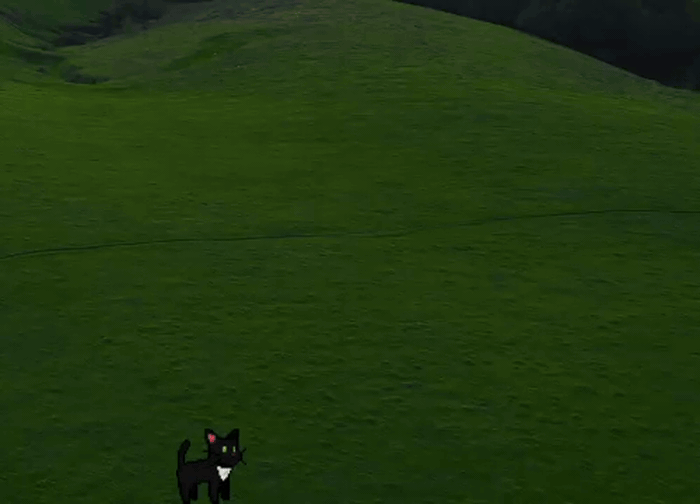
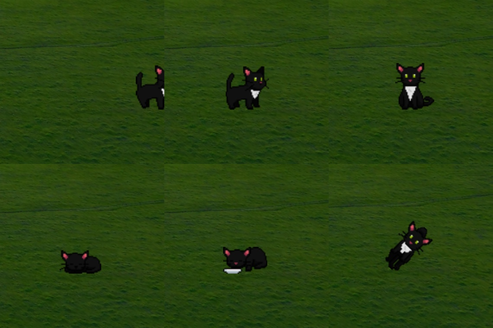
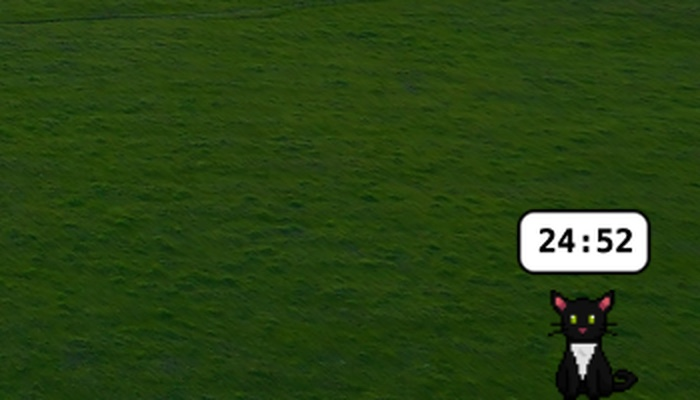
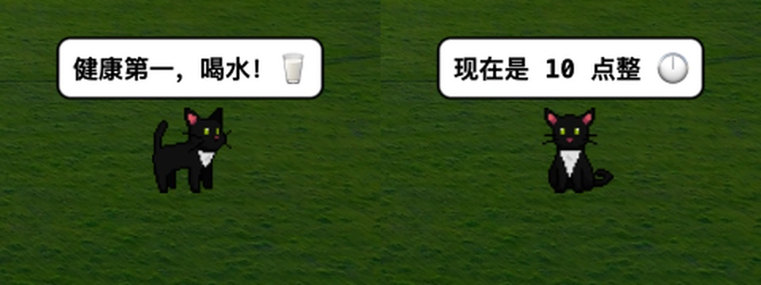

# 桌面宠物

屏幕最下边养一只猫：自己散步、睡觉、发呆，被拎起来会飞，也能提醒你喝水和整点报时。

## 为什么做

每天在电脑前坐很久，桌面是静止的。之前做过一缸桌面水族馆，鱼是养来看的：好看，但你不能碰它。

这次想要一只能逗的：它自己在屏幕底下过日子，我偶尔去拎它一下，顺手还能提醒我喝水。它只有 64 像素高，大概一个图标那么大，脚踩在屏幕最底边，好像桌面就是它的地板。

## 关键的取舍

**只占屏幕最下边一条。** 窗口是全屏透明的，但猫只在地面上走。好处是它几乎不影响你看任何东西；代价是它不会跑到屏幕中间来，想看清它得往下瞟一眼。

**不抢鼠标。** 鼠标不在猫身上时，窗口直接把鼠标事件让出去，点桌面、拖文件、右键菜单全都正常；鼠标移到猫身上，光标才变成一只小手。代价是每 0.1 秒要算一次鼠标位置。

**挂在所有窗口上面。** 窗口层级设成 `.statusBar`，所以你翻文档、看视频它都在。代价是它会压住窗口最下边的一条（比如浏览器状态栏），而全屏 Space 里则不出现。

**不联网、不注册、不写文件。** 只有偏好设置写进 UserDefaults，别的一点痕迹都不留。

## 它一天在干什么

它脑子里没有剧本，只有一张状态表，每条都有优先级：

**环境**（最高）被拎起来、下落、被风吹、挂在屏幕边缘——物理说了算，谁也叫不动它。
**打断** 喝水提醒、整点报时。可以打断专注，但得等风吹完。
**系统** 专注模式，也就是番茄钟。
**玩耍** 企鹅专属的滑行。
**日常**（最低）发呆、散步、坐着、吃饭、睡觉，随机挑一样。

散步的权重是别的高三倍——一只猫大部分时间在走路，看起来才像在过日子。

## 鼠标能做两件事

**左键把它拎起来。** 按住拖走，松手时按你甩的方向飞出去，落地弹一下接着走；拖的时候它会朝移动的方向转头。要是它挂在屏幕边上，点一下就能救下来，还会"啵"一声。

**右键是番茄钟。** 右键菜单里开始专注（默认 25 分钟，可改），它会走到屏幕右下角坐好，头顶显示倒计时。时间到了响一声玻璃音，再冒一句"完成啦！🎉"。专注期间左键拎不动它——不然一手滑就把番茄钟取消了。

## 三个提醒

喝水提醒默认 45 分钟一次，可选 15 / 30 / 45 / 60 分钟，到点冒个气泡，话是随机挑的（"该喝水啦！🥤"、"咕嘟咕嘟…"）。

整点报时每到整点说一句话：中午 12 点是"干饭！🍖"，午夜是"睡觉觉！💤"，凌晨是"呼呼… 3 点…"。

两个都能单独关掉——不需要提醒的人，只想要那只猫。

## 被风吹起来

这条是我自己加的彩蛋（菜单里还留着"测试"字样）。两条正弦波加一点噪声：慢波决定整体往哪飘，快波添抖动，竖直方向给一个缓慢的升力，横向速度再映射成身体的倾斜。飘到屏幕边缘没抓住，它就挂在那儿，等你点一下把它救下来。

## 踩过的坑

**全屏透明窗口会吃掉整个桌面的点击。** 一开始窗口接收所有鼠标事件，结果桌面点不动了。现在定时算一次鼠标在不在猫身上，不在就让窗口忽略鼠标事件。

**CPU。** 全屏透明一直重绘很费电，做了几件事：静止的状态（坐、睡、吃、发呆）直接跳过物理计算；帧率锁在 30；鼠标检测降到 10Hz；配置从 UserDefaults 读一次缓存起来，不再每帧去读。

**透明窗口不能开阴影。** 系统要一直重算阴影，直接关掉。

## 现在有的和没有的

有的：一只黑猫（7 组动作、50 帧）、喝水提醒、整点报时、番茄钟、拖拽和风吹、中英文两套文案。

还没有的：代码里还躺着一只企鹅（走路慢、会滑行），没排进出场名单；`.system(.highCPU)` 和 `.system(.lowBattery)` 两个状态也只写了状态和动画——本来想让它在我电脑发烫时烦躁、快没电时打蔫，系统监控还没接上。

## 关于素材

代码是我写的，猫的像素素材用的是现成素材包，版权归原作者，不在 MIT 协议范围内。

## 回头看

动手之前我以为最难的是让它看起来像只猫，做下来发现难的是**谁有权打断谁**。优先级表改过好几版：喝水提醒该不该打断睡觉？风吹着的时候还能不能报时？最后定下来的规矩是物理最大，其次是提醒，再次是专注，日常垫底。

> 它不用聪明，只要看起来像在过自己的日子。

## 跑起来

- macOS 11.5 或更新版本，用 Xcode 打开 `Companion.xcodeproj`，选 `Companion` scheme 运行。
- 启动后没有 Dock 图标和窗口，宠物会出现在屏幕最下边；菜单栏的猫图标是设置入口。
- 菜单里的"测试：整点报时 / 喝水提醒 / 被风吹起"是调试用的开关，随时可以手动触发一次。

## 协议

代码用 [MIT](./LICENSE) 协议开源；猫的像素素材版权归原作者，不在 MIT 范围内。
